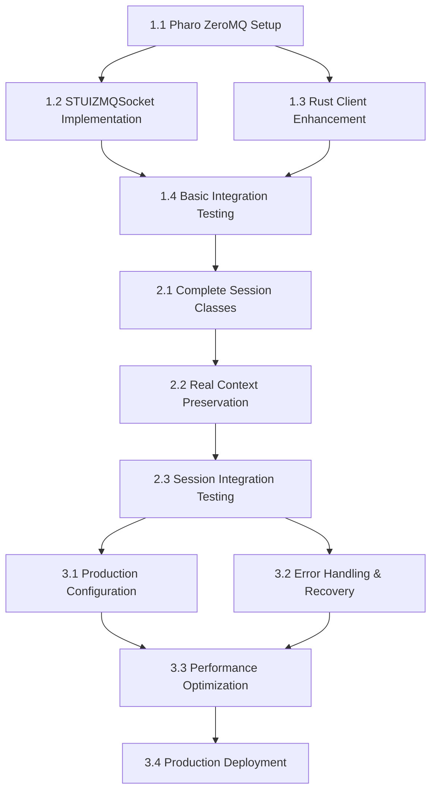

# ZeroMQ Integration Tasks

> **Status**: Ready for Implementation  
> **Squad**: Elite (Rust + Smalltalk/Pharo)  
> **Total Effort**: 9-13 hours

## Task Breakdown

### Phase 1: ZeroMQ Infrastructure (4-6 hours)

#### 🔧 Task 1.1: Pharo ZeroMQ Setup
**Assignee**: @software-engineer  
**Duration**: 1.5-2 hours  
**Priority**: Critical

**Subtasks**:
- [ ] **1.1.1** Evaluate `github://zeromq/zeromq-pharo` binding quality
  - Install and test basic functionality
  - Assess performance and stability
  - Document findings and recommendation
  
- [ ] **1.1.2** Implement FFI fallback (if primary binding fails)
  - Create `ZMQLibrary`, `ZMQContext`, `ZMQSocket` classes
  - Implement core FFI methods for socket operations
  - Test fallback implementation

**Quality Gates**:
- [ ] ZeroMQ installation successful
- [ ] Socket creation and binding working
- [ ] Message send/receive functional
- [ ] Fallback path tested (if needed)

**Deliverables**:
- Working ZeroMQ integration in Pharo
- Decision documentation (primary vs FFI)
- Test results and performance baseline

---

#### 🔧 Task 1.2: STUIZMQSocket Implementation  
**Assignee**: @software-engineer  
**Duration**: 1.5-2 hours  
**Priority**: Critical  

**Subtasks**:
- [ ] **1.2.1** Create production-ready `STUIZMQSocket` class
  - Implement automatic binding/FFI detection
  - Add comprehensive error handling
  - Create socket lifecycle management
  
- [ ] **1.2.2** Integrate with existing `STUIServer`
  - Replace mock socket implementation
  - Update message handling loops
  - Enhance server error recovery

**Quality Gates**:
- [ ] Socket creation and binding working
- [ ] Integration with STUIServer successful
- [ ] Error handling comprehensive
- [ ] Mock mode compatibility maintained

**Deliverables**:
- Complete `STUIZMQSocket` implementation
- Updated `STUIServer` with ZeroMQ integration
- Comprehensive error handling and logging

---

#### 🔧 Task 1.3: Rust Client Enhancement
**Assignee**: @software-engineer  
**Duration**: 1-1.5 hours  
**Priority**: Critical

**Subtasks**:
- [ ] **1.3.1** Update `DemoClient` for real ZeroMQ
  - Replace TCP connection with ZeroMQ REQ socket
  - Add connection timeout and retry logic
  - Implement graceful disconnect handling
  
- [ ] **1.3.2** Enhance configuration system
  - Add ZeroMQ-specific configuration options
  - Support protocol selection (zeromq/tcp)
  - Add connection health monitoring settings

**Quality Gates**:
- [ ] ZeroMQ connection established successfully
- [ ] Configuration system supports both protocols
- [ ] Connection handling robust and reliable
- [ ] Backward compatibility with existing demos

**Deliverables**:
- Enhanced `DemoClient` with ZeroMQ support
- Updated configuration system
- Connection management improvements

---

#### 🔧 Task 1.4: Basic Integration Testing
**Assignee**: @software-engineer + @git-workflow  
**Duration**: 30-45 minutes  
**Priority**: Critical

**Subtasks**:
- [ ] **1.4.1** End-to-end connectivity testing
  - Start Pharo server with ZeroMQ
  - Connect Rust client via ZeroMQ
  - Verify JSON protocol compatibility
  - Test connection lifecycle management

**Quality Gates**:
- [ ] Full ZeroMQ connection established
- [ ] JSON messages transmitted correctly
- [ ] No crashes, hangs, or memory leaks
- [ ] Connection teardown clean and complete

**Deliverables**:
- Verified end-to-end ZeroMQ integration
- Test results and performance metrics
- Integration test suite foundation

---

### Phase 2: Real Session Management (3-4 hours)

#### 🏗️ Task 2.1: Complete Session Classes
**Assignee**: @software-engineer  
**Duration**: 1.5-2 hours  
**Priority**: High

**Subtasks**:
- [ ] **2.1.1** Implement production `STUISessionManager`
  - Real session creation and management
  - Integration with Pharo Workspace objects
  - Session persistence and recovery
  
- [ ] **2.1.2** Enhanced `STUISession` with real context
  - Real Smalltalk workspace integration
  - Evaluation history with actual objects
  - Object registry for inspection support

**Quality Gates**:
- [ ] Session creation and management working
- [ ] Real Smalltalk workspace integration
- [ ] Session state persistence functional
- [ ] Multi-session support validated

**Deliverables**:
- Complete session management system
- Real context preservation implementation
- Session persistence across connections

---

#### 🏗️ Task 2.2: Real Context Preservation
**Assignee**: @software-engineer  
**Duration**: 1-1.5 hours  
**Priority**: High

**Subtasks**:
- [ ] **2.2.1** Enhanced `STUIEvaluator` with real workspace
  - Integration with actual Pharo Workspace
  - Real Smalltalk code evaluation
  - Evaluation history with object references
  
- [ ] **2.2.2** Real object inspection implementation
  - Actual Pharo object introspection
  - Class and method information extraction
  - Instance variable inspection

**Quality Gates**:
- [ ] Real Smalltalk code evaluation working
- [ ] Object inspection shows actual Pharo objects
- [ ] Evaluation history preserved correctly
- [ ] Context restored accurately after reconnection

**Deliverables**:
- Real Smalltalk evaluation capability
- Comprehensive object inspection
- Context preservation and restoration

---

#### 🏗️ Task 2.3: Session Integration Testing
**Assignee**: @software-engineer  
**Duration**: 30-45 minutes  
**Priority**: High

**Subtasks**:
- [ ] **2.3.1** Complete session workflow testing
  - Create session via ZeroMQ
  - Evaluate complex Smalltalk expressions
  - Inspect resulting objects and variables
  - Save/restore session context across disconnections

**Quality Gates**:
- [ ] Full session lifecycle working via ZeroMQ
- [ ] Real Smalltalk evaluation functional
- [ ] Object inspection comprehensive
- [ ] Session persistence reliable

**Deliverables**:
- Validated session management workflow
- Real-world usage scenarios tested
- Performance and reliability metrics

---

### Phase 3: Production Polish (2-3 hours)

#### ⚡ Task 3.1: Production Configuration
**Assignee**: @software-engineer  
**Duration**: 45-60 minutes  
**Priority**: Medium

**Subtasks**:
- [ ] **3.1.1** Enhanced Rust configuration system
  - ZeroMQ-specific parameters (HWM, linger, heartbeat)
  - Environment-based configuration
  - Production vs development settings
  
- [ ] **3.1.2** Pharo server configuration
  - Production ZeroMQ settings
  - Performance tuning parameters
  - Security and monitoring options

**Quality Gates**:
- [ ] Configuration supports all deployment scenarios
- [ ] Performance parameters tunable
- [ ] Security settings available
- [ ] Environment-specific configurations working

**Deliverables**:
- Complete configuration system
- Production deployment configurations
- Performance tuning documentation

---

#### ⚡ Task 3.2: Error Handling & Recovery
**Assignee**: @software-engineer  
**Duration**: 1-1.5 hours  
**Priority**: Medium

**Subtasks**:
- [ ] **3.2.1** Connection health monitoring
  - Heartbeat/keepalive implementation
  - Connection failure detection
  - Automatic reconnection logic
  
- [ ] **3.2.2** Graceful error recovery
  - Network failure handling
  - Invalid message recovery
  - Resource cleanup on errors

**Quality Gates**:
- [ ] Connection monitoring reliable
- [ ] Error recovery graceful and automatic
- [ ] No resource leaks during error scenarios
- [ ] System stability under failure conditions

**Deliverables**:
- Robust error handling system
- Connection health monitoring
- Automatic recovery mechanisms

---

#### ⚡ Task 3.3: Performance Optimization
**Assignee**: @software-engineer  
**Duration**: 30-45 minutes  
**Priority**: Low

**Subtasks**:
- [ ] **3.3.1** Message processing optimization
  - Reduce serialization overhead
  - Optimize message routing
  - Memory usage optimization
  
- [ ] **3.3.2** Performance monitoring
  - Add timing metrics
  - Memory usage tracking
  - Connection statistics

**Quality Gates**:
- [ ] Performance meets requirements (>100 RPS)
- [ ] Memory usage stable (<100MB)
- [ ] Latency within acceptable limits (<100ms p95)
- [ ] Monitoring and metrics available

**Deliverables**:
- Optimized message processing
- Performance monitoring system
- Benchmark results and analysis

---

#### ⚡ Task 3.4: Production Deployment
**Assignee**: @git-workflow  
**Duration**: 30 minutes  
**Priority**: Low

**Subtasks**:
- [ ] **3.4.1** Deployment documentation
  - Installation instructions
  - Configuration guidelines
  - Troubleshooting guide
  
- [ ] **3.4.2** Demo script updates
  - Update demo for real ZeroMQ integration
  - Performance demonstration script
  - Stakeholder presentation materials

**Quality Gates**:
- [ ] Documentation complete and accurate
- [ ] Deployment process validated
- [ ] Demo materials ready for stakeholders
- [ ] Production checklist complete

**Deliverables**:
- Complete deployment documentation
- Updated demo materials
- Production readiness assessment

---

## Task Dependencies

## Critical Path Tasks

1. **1.1 Pharo ZeroMQ Setup** - Foundation for everything
2. **1.2 STUIZMQSocket Implementation** - Core integration
3. **1.4 Basic Integration Testing** - Validation checkpoint
4. **2.1 Complete Session Classes** - Real functionality
5. **2.3 Session Integration Testing** - End-to-end validation

## Risk Mitigation

### High-Risk Tasks
- **1.1 Pharo ZeroMQ Setup** - Dependency on external library
  - Mitigation: FFI fallback implementation ready
  - Contingency: +1.5 hours for FFI implementation

### Medium-Risk Tasks  
- **2.2 Real Context Preservation** - Complex Smalltalk integration
  - Mitigation: Incremental implementation approach
  - Contingency: +0.5 hours for debugging

### Dependencies
- ZeroMQ libraries installed on development machine
- Pharo development environment working
- Rust ZMQ crate compatibility verified

## Success Criteria

### Functional Success
- [ ] All 11 STUI protocol commands working via ZeroMQ
- [ ] Real Smalltalk code evaluation functional
- [ ] Session management with actual Pharo objects
- [ ] Context preservation across disconnections

### Performance Success
- [ ] >100 requests/second sustained throughput
- [ ] <100ms p95 latency for simple commands
- [ ] 8+ hour session stability demonstrated
- [ ] 5+ concurrent clients supported

### Quality Success
- [ ] Zero crashes in 4-hour continuous testing
- [ ] Memory usage stable over extended periods
- [ ] Graceful error handling and recovery
- [ ] Production deployment ready

**All tasks ready for implementation. Proceed with Phase 1 when approved.**
