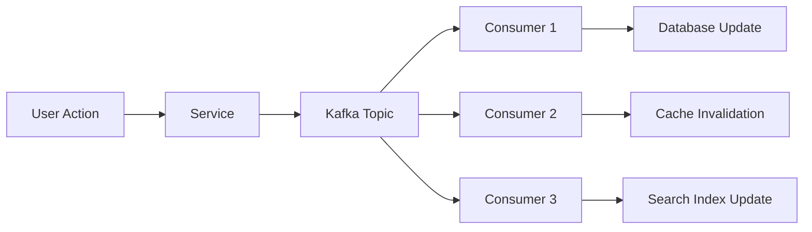
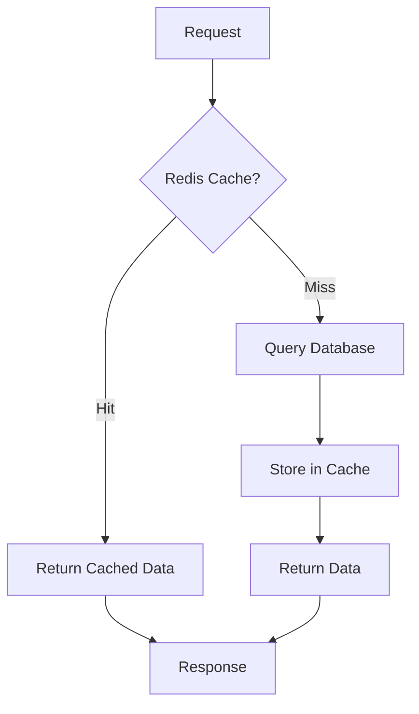
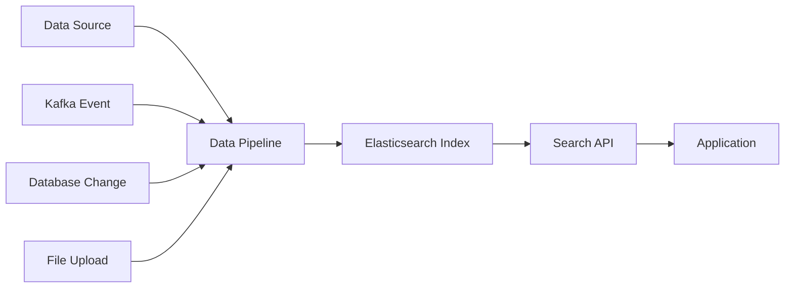

# Data Technology Integration Overview

This document provides a comprehensive overview of how different data technologies integrate and complement each other in modern applications, covering SQL databases, NoSQL databases, message queues, caching, and search engines.

## 🏗️ **Modern Data Architecture Overview**

### **Data Technology Stack Layers:**

```
┌─────────────────────────────────────────────────────────────┐
│                    Application Layer                        │
├─────────────────────────────────────────────────────────────┤
│                    API Gateway / Load Balancer              │
├─────────────────────────────────────────────────────────────┤
│  ┌─────────────┐ ┌─────────────┐ ┌─────────────┐          │
│  │   Web App   │ │  Mobile App │ │   API App   │          │
│  └─────────────┘ └─────────────┘ └─────────────┘          │
├─────────────────────────────────────────────────────────────┤
│                    Service Layer                            │
├─────────────────────────────────────────────────────────────┤
│  ┌─────────────┐ ┌─────────────┐ ┌─────────────┐          │
│  │ User Service│ │Order Service│ │Payment Svc  │          │
│  └─────────────┘ └─────────────┘ └─────────────┘          │
├─────────────────────────────────────────────────────────────┤
│                    Data Layer                               │
├─────────────────────────────────────────────────────────────┤
│  ┌─────────────┐ ┌─────────────┐ ┌─────────────┐          │
│  │ PostgreSQL  │ │  MongoDB    │ │   Redis     │          │
│  │   (SQL)     │ │ (Document)  │ │  (Cache)    │          │
│  └─────────────┘ └─────────────┘ └─────────────┘          │
│  ┌─────────────┐ ┌─────────────┐ ┌─────────────┐          │
│  │   Kafka     │ │Elasticsearch│ │   Neo4j     │          │
│  │ (Streaming) │ │  (Search)   │ │  (Graph)    │          │
│  └─────────────┘ └─────────────┘ └─────────────┘          │
└─────────────────────────────────────────────────────────────┘
```

## 🔄 **Data Flow Patterns**

### **1. Event-Driven Architecture with Kafka**



**Example Flow:**
1. **User updates profile** → User Service
2. **Service publishes event** → `user.profile.updated` Kafka topic
3. **Multiple consumers process event:**
   - **Database Consumer**: Updates PostgreSQL user table
   - **Cache Consumer**: Invalidates Redis user cache
   - **Search Consumer**: Updates Elasticsearch user index

### **2. Caching Strategy with Redis**



**Cache Patterns:**
- **Cache-Aside**: Application manages cache manually
- **Write-Through**: Cache and database updated simultaneously
- **Write-Behind**: Cache updated first, database updated asynchronously

### **3. Search Integration with Elasticsearch**



**Search Integration Points:**
- **Real-time indexing** from Kafka events
- **Batch synchronization** from database changes
- **File processing** for document search

## 🎯 **Technology Selection Guide**

### **When to Use Each Technology:**

| Use Case | Primary Technology | Supporting Technologies | Rationale |
|----------|-------------------|------------------------|-----------|
| **User Authentication** | PostgreSQL | Redis (sessions) | ACID compliance, security |
| **Product Catalog** | MongoDB | Elasticsearch (search) | Flexible schema, rich queries |
| **Order Processing** | PostgreSQL | Kafka (events) | Transactional integrity |
| **User Sessions** | Redis | - | Fast access, TTL support |
| **Real-time Analytics** | Kafka | Redis (aggregations) | Stream processing, low latency |
| **Full-text Search** | Elasticsearch | - | Advanced search capabilities |
| **Recommendations** | Redis | PostgreSQL (user data) | Fast similarity calculations |
| **Audit Logging** | Kafka | Elasticsearch (search) | Event streaming, searchable logs |

### **Technology Combinations:**

#### **E-commerce Platform:**
```
User Management: PostgreSQL + Redis (sessions)
Product Catalog: MongoDB + Elasticsearch (search)
Order Processing: PostgreSQL + Kafka (events)
Inventory: Redis + PostgreSQL (real-time + persistent)
Analytics: Kafka + Elasticsearch + Redis
```

#### **Social Media Platform:**
```
User Profiles: PostgreSQL + Redis (caching)
Content: MongoDB + Elasticsearch (search)
Activity Feed: Redis + Kafka (real-time)
Relationships: Neo4j (graph) + PostgreSQL (metadata)
Notifications: Kafka + Redis (queuing)
```

#### **Financial Platform:**
```
Transactions: PostgreSQL (ACID) + Kafka (audit)
User Accounts: PostgreSQL + Redis (balances)
Risk Analysis: Kafka + Elasticsearch + Redis
Compliance: PostgreSQL + Elasticsearch (search)
Real-time Pricing: Redis + Kafka (streams)
```

## 🔧 **Integration Patterns**

### **1. Database + Cache Pattern**

```javascript
// Example: User Profile with Redis Cache
async function getUserProfile(userId) {
  // Try cache first
  const cached = await redis.get(`user:${userId}:profile`);
  if (cached) {
    return JSON.parse(cached);
  }
  
  // Cache miss - query database
  const profile = await db.query(
    'SELECT * FROM users WHERE id = ?', 
    [userId]
  );
  
  if (profile) {
    // Cache for 1 hour
    await redis.setex(
      `user:${userId}:profile`, 
      3600, 
      JSON.stringify(profile)
    );
  }
  
  return profile;
}
```

### **2. Event Sourcing with Kafka**

```javascript
// Example: User Profile Update Event
async function updateUserProfile(userId, updates) {
  // Update database
  await db.query(
    'UPDATE users SET name = ?, email = ? WHERE id = ?',
    [updates.name, updates.email, userId]
  );
  
  // Publish event
  await kafka.producer.send({
    topic: 'user.profile.updated',
    key: userId,
    value: {
      user_id: userId,
      event_type: 'profile.updated',
      timestamp: new Date().toISOString(),
      changes: updates
    }
  });
  
  // Invalidate cache
  await redis.del(`user:${userId}:profile`);
}
```

### **3. Search Integration Pattern**

```javascript
// Example: Elasticsearch Index Update
async function handleUserProfileUpdate(event) {
  const { user_id, changes } = event;
  
  // Get full user data
  const user = await db.query(
    'SELECT * FROM users WHERE id = ?', 
    [user_id]
  );
  
  // Update search index
  await elasticsearch.update({
    index: 'users',
    id: user_id,
    body: {
      doc: user,
      doc_as_upsert: true
    }
  });
}
```

## 📊 **Data Synchronization Strategies**

### **1. Real-time Synchronization**

```yaml
# Kafka Connect Configuration
connectors:
  - name: postgres-to-elasticsearch
    config:
      connector.class: io.confluent.connect.jdbc.JdbcSourceConnector
      connection.url: jdbc:postgresql://localhost:5432/mydb
      table.whitelist: users,products,orders
      mode: timestamp
      timestamp.column.name: updated_at
      
  - name: elasticsearch-sink
    config:
      connector.class: io.confluent.connect.elasticsearch.ElasticsearchSinkConnector
      connection.url: http://localhost:9200
      type.name: _doc
      key.converter: org.apache.kafka.connect.storage.StringConverter
      value.converter: org.apache.kafka.connect.json.JsonConverter
```

### **2. Batch Synchronization**

```javascript
// Example: Daily sync job
async function syncDatabaseToSearch() {
  const batchSize = 1000;
  let offset = 0;
  
  while (true) {
    const users = await db.query(
      'SELECT * FROM users WHERE updated_at > ? ORDER BY updated_at LIMIT ? OFFSET ?',
      [lastSyncTime, batchSize, offset]
    );
    
    if (users.length === 0) break;
    
    // Bulk index to Elasticsearch
    const bulkBody = users.flatMap(user => [
      { index: { _index: 'users', _id: user.id } },
      user
    ]);
    
    await elasticsearch.bulk({ body: bulkBody });
    
    offset += batchSize;
  }
}
```

### **3. Change Data Capture (CDC)**

```yaml
# Debezium Configuration
connector:
  name: postgres-connector
  config:
    connector.class: io.debezium.connector.postgresql.PostgresConnector
    database.hostname: localhost
    database.port: 5432
    database.user: debezium
    database.password: dbz
    database.dbname: mydb
    database.server.name: mydb
    table.include.list: public.users,public.products
    plugin.name: pgoutput
```

## 🚀 **Performance Optimization**

### **1. Caching Strategy**

```yaml
# Multi-level caching
cache_layers:
  l1:
    technology: Redis
    location: Application memory
    ttl: 5 minutes
    size: 100MB
    
  l2:
    technology: Redis
    location: Shared cache server
    ttl: 1 hour
    size: 1GB
    
  l3:
    technology: PostgreSQL
    location: Database
    ttl: N/A
    size: Unlimited
```

### **2. Read Replicas**

```yaml
# Database read scaling
postgresql:
  primary:
    host: db-primary
    port: 5432
    role: master
    
  replicas:
    - host: db-replica-1
      port: 5432
      role: slave
      lag_threshold: 10s
      
    - host: db-replica-2
      port: 5432
      role: slave
      lag_threshold: 10s
```

### **3. Sharding Strategy**

```yaml
# MongoDB sharding
mongodb:
  shards:
    - name: shard1
      hosts: ["mongo1:27017", "mongo2:27017"]
      key: { user_id: "hashed" }
      
    - name: shard2
      hosts: ["mongo3:27017", "mongo4:27017"]
      key: { user_id: "hashed" }
```

## 🔒 **Security and Compliance**

### **1. Data Encryption**

```yaml
# Encryption at rest and in transit
security:
  encryption:
    at_rest:
      algorithm: AES-256
      key_management: AWS KMS
      
    in_transit:
      protocol: TLS 1.3
      certificate: Let's Encrypt
      
  authentication:
    method: JWT + OAuth2
    session_timeout: 24 hours
```

### **2. Access Control**

```yaml
# Role-based access control
rbac:
  roles:
    admin:
      permissions: ["read", "write", "delete", "admin"]
      resources: ["*"]
      
    user:
      permissions: ["read", "write"]
      resources: ["own_data"]
      
    analyst:
      permissions: ["read"]
      resources: ["analytics_data"]
```

### **3. Data Privacy**

```yaml
# GDPR compliance
privacy:
  data_retention:
    user_profiles: 7 years
    activity_logs: 2 years
    search_queries: 90 days
    
  data_deletion:
    method: soft_delete
    retention: 30 days
    audit_trail: true
```

## 📈 **Monitoring and Observability**

### **1. Key Metrics**

```yaml
# Performance metrics
metrics:
  database:
    - query_response_time
    - connection_pool_usage
    - slow_query_count
    
  cache:
    - hit_rate
    - memory_usage
    - eviction_rate
    
  message_queue:
    - message_lag
    - consumer_lag
    - throughput
    
  search:
    - query_latency
    - index_size
    - search_throughput
```

### **2. Health Checks**

```javascript
// Example health check
async function checkDataLayerHealth() {
  const health = {
    status: 'healthy',
    checks: {}
  };
  
  // Check PostgreSQL
  try {
    await db.query('SELECT 1');
    health.checks.postgresql = 'healthy';
  } catch (error) {
    health.checks.postgresql = 'unhealthy';
    health.status = 'degraded';
  }
  
  // Check Redis
  try {
    await redis.ping();
    health.checks.redis = 'healthy';
  } catch (error) {
    health.checks.redis = 'unhealthy';
    health.status = 'degraded';
  }
  
  // Check Kafka
  try {
    await kafka.admin.listTopics();
    health.checks.kafka = 'healthy';
  } catch (error) {
    health.checks.kafka = 'unhealthy';
    health.status = 'degraded';
  }
  
  // Check Elasticsearch
  try {
    await elasticsearch.cluster.health();
    health.checks.elasticsearch = 'healthy';
  } catch (error) {
    health.checks.elasticsearch = 'unhealthy';
    health.status = 'degraded';
  }
  
  return health;
}
```

## 🎯 **Best Practices Summary**

### **Do's:**
- ✅ **Choose the right tool for the job** - Don't force one technology to do everything
- ✅ **Design for scalability** - Plan for growth from the start
- ✅ **Implement proper monitoring** - Know what's happening in your system
- ✅ **Use caching strategically** - Cache frequently accessed data
- ✅ **Plan for failure** - Implement proper error handling and fallbacks
- ✅ **Test thoroughly** - Test with realistic data volumes and scenarios

### **Don'ts:**
- ❌ **Don't over-engineer** - Start simple and add complexity as needed
- ❌ **Don't ignore security** - Implement proper authentication and authorization
- ❌ **Don't skip monitoring** - You can't optimize what you can't measure
- ❌ **Don't forget about data consistency** - Understand eventual vs strong consistency
- ❌ **Don't ignore operational concerns** - Consider backup, recovery, and maintenance

## 🔮 **Future Considerations**

### **Emerging Technologies:**
- **GraphQL**: For flexible API queries
- **gRPC**: For high-performance service communication
- **Apache Pulsar**: Alternative to Kafka with better geo-replication
- **ClickHouse**: For real-time analytics
- **ScyllaDB**: High-performance Cassandra alternative

### **Trends:**
- **Serverless databases**: Managed services with automatic scaling
- **Edge computing**: Processing data closer to users
- **AI/ML integration**: Intelligent data processing and insights
- **Multi-cloud**: Avoiding vendor lock-in
- **Data mesh**: Decentralized data ownership and architecture

This overview ensures comprehensive understanding of modern data technology integration patterns and best practices for building scalable, maintainable applications.
